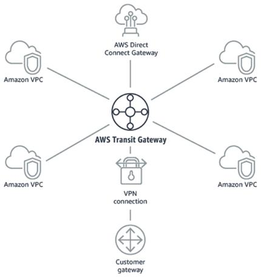
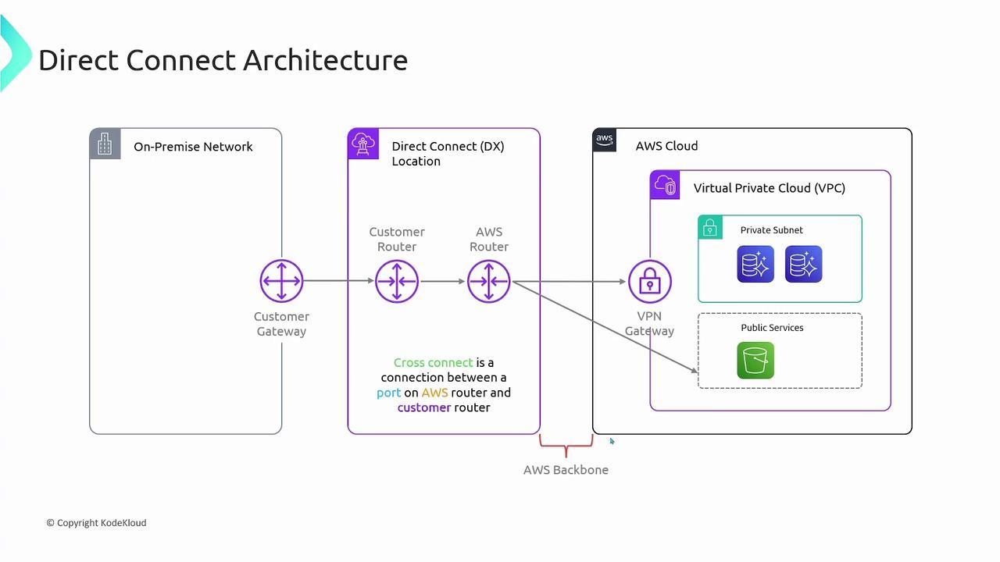
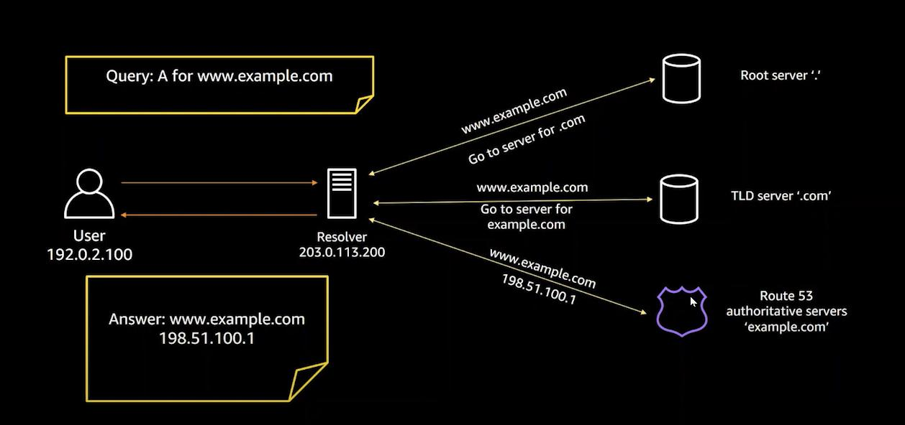
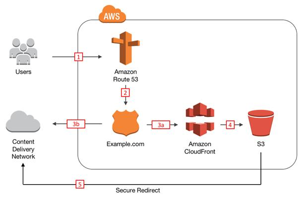

# A-W-S

AWS Transit Gateway : A Transit Gateway in AWS is basically a central network hub that connects multiple  network together  in a clean ,scalable way 

Instead of manually connecting everything to everything (which becomes messy) ,you plug everything into one central router    

AWS Direct Connect : A Direct Connect is a service that gives you a private ,dedicated network connection from your on-premises data center -> AWS

Instead of using the public internet ,you get a direct physical connection into AWS 

AWS VPC Peering : The purpose of the VPC peering is to let two VPC's communicate privately as if they are part of the same network 

No network ,no NAT ,no public exposure - just secure internal communication 
[Ex : VPC1 : frontend VPC2: backend  peering allows frontend to call the backend api privately no public exposure of backend]

AWS ROUTE 53 : It translate a domain name like example.com into  the ip address of the server where your application is running 

AWS CloudFront: AWS CloudFront is a Content Delivery Network  that stores copies of your website in servers around the world and deliveries it  from the nearest location to the user[ if its already cached in the nearest location if its not cached then it will be taken from the server and cached so that the next request willl be faster ] ,making the website  faster ,redusing the load on the server and improving the security

![

